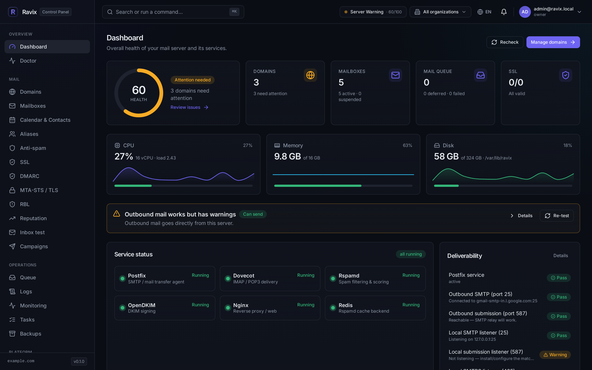
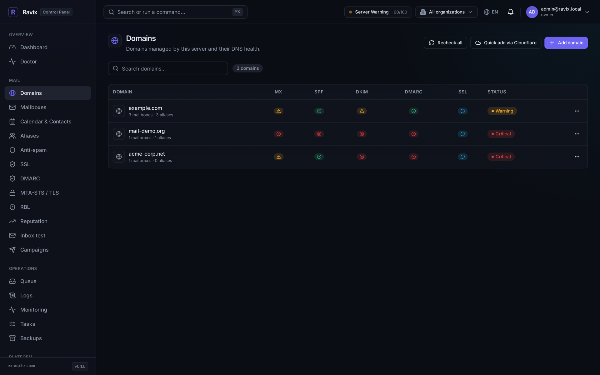
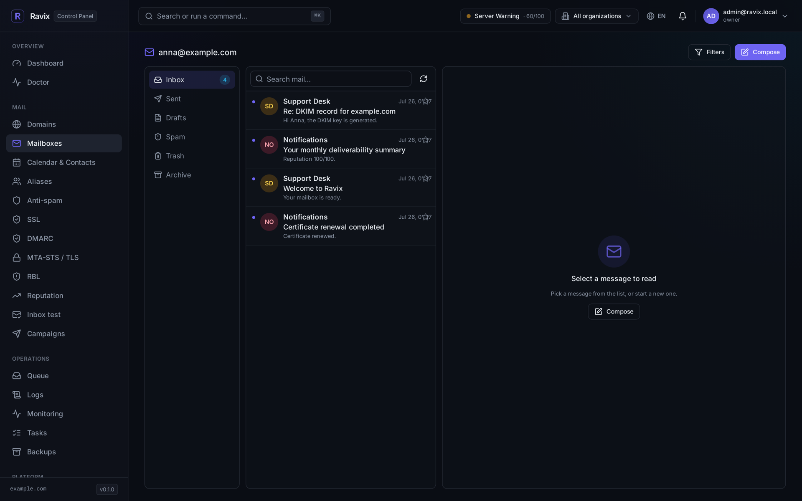
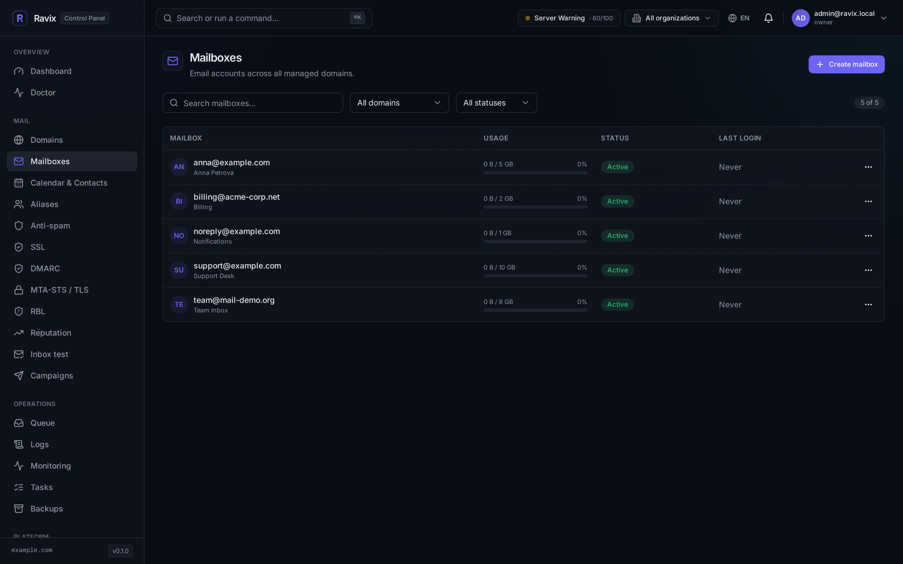
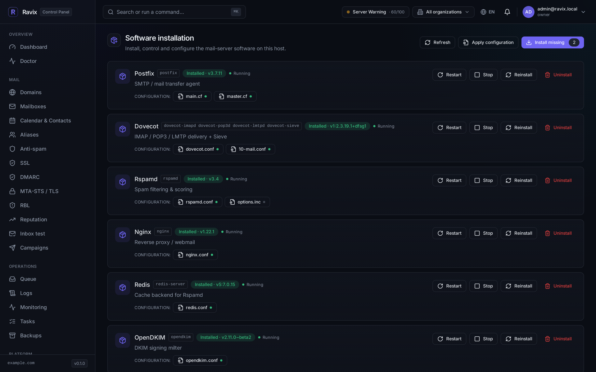
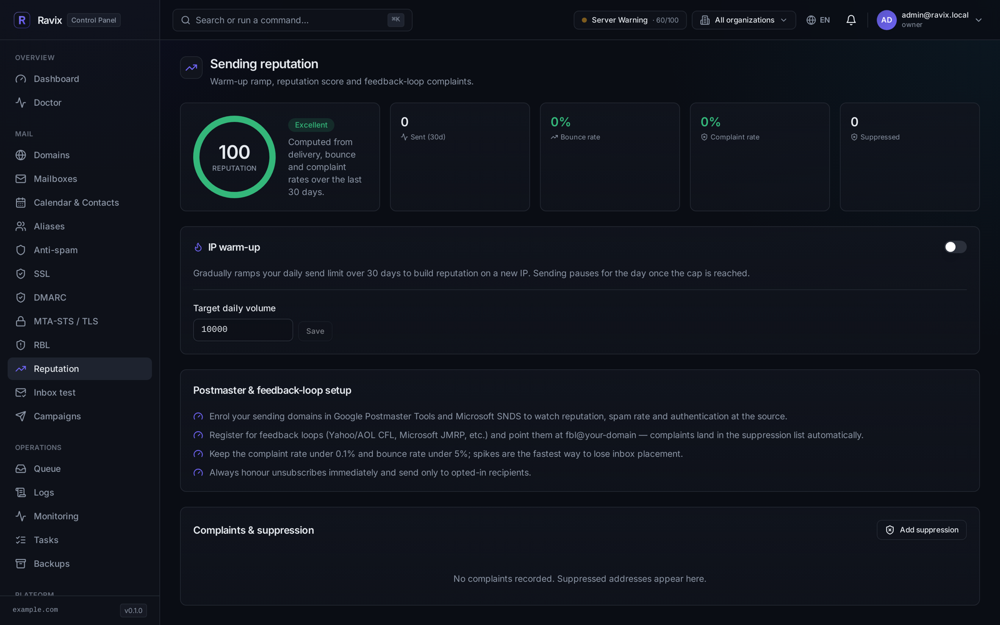
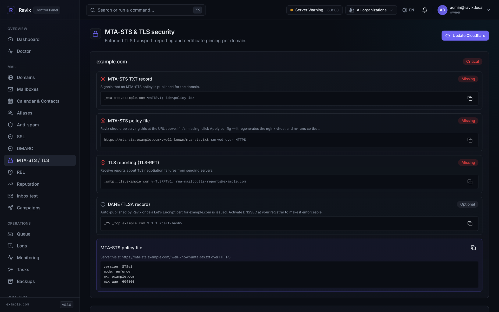

<div align="center">


# Ravix

### 私有邮件基础设施，由你自己掌控。

一个面向真实 Linux 邮件服务器的自托管控制面板 —— 从同一个仪表盘部署并管理
Postfix、Dovecot、Rspamd、OpenDKIM 和 Certbot。

[](LICENSE)
[](https://github.com/tnAnGel/Ravix/actions/workflows/ci.yml)
[](https://github.com/tnAnGel/Ravix/releases)
[](https://adoptium.net/)
[](https://react.dev/)

**[文档](docs/zh/README.md)** ·
[English](README.md) · [Русский](README.ru.md) · **中文**

</div>

---

<div align="center">
  
</div>

---

## 这是什么

Ravix **不是**邮件服务器。它是邮件服务器的控制平面。

你提供一台全新的 Debian 或 Ubuntu 主机；Ravix 在其上安装 Postfix、Dovecot、
Rspamd 和 OpenDKIM，从你通过 Web 界面编辑的数据库中渲染出它们的配置，
并持续监控真正决定邮件能否送达的那些因素 —— DNS 记录、DKIM 签名、DMARC 报告、
黑名单、TLS 状态以及发信信誉。

```bash
curl -fsSL https://raw.githubusercontent.com/tnAnGel/Ravix/main/install.sh | sudo bash
```

一条命令，约 30–60 秒，面板就绪。完整说明见 **[安装](docs/zh/installation.md)**。

> [!WARNING]
> **Ravix 0.1 是预发布版本。** 会话已改用 `HttpOnly` Cookie，登录有频率限制，
> CORS 收窄为同源 —— 但**后端仍以 root 身份运行**，因为它需要部署邮件栈。
> 请把面板访问权视同 root 权限。在把公网 DNS 名称指向面板之前，请先阅读
> **[安全](docs/zh/security.md)**；其余弱点均为公开记录，并未隐瞒。

## 功能

<table>
<tr>
<td width="50%" valign="top">

### 📮 邮件平台
- 域名、邮箱、别名与 Sieve 过滤器
- Postfix / Dovecot / Rspamd / OpenDKIM 配置下发
- 通过 `apt` 与 `systemd` 管理软件包和服务
- Postfix 队列：查看、重试、保留、删除
- 通过 Certbot 管理 Let's Encrypt 证书
- 内置 webmail，支持文件夹、搜索与写信
- 通过 Radicale 提供 CalDAV / CardDAV

</td>
<td width="50%" valign="top">

### 📈 送达率
- 按域名实时检查 MX / SPF / DKIM / DMARC / PTR
- 生成 2048 位 DKIM 密钥并给出 DNS 配置指引
- 摄取 DMARC 聚合报告并按来源分析
- MTA-STS、TLS-RPT 与 DANE / TLSA 状态
- RBL / DNSBL 监控及历史记录
- 滚动 30 天的发信信誉评分
- IP 预热每日上限与 FBL 投诉抑制

</td>
</tr>
<tr>
<td width="50%" valign="top">

### 🔐 访问控制
- BCrypt 密码哈希，基于会话的认证
- TOTP 两步验证
- `owner` / `admin` / `viewer` 角色
- 组织与租户隔离
- 用于自动化的 API 密钥（`rvx_live_…`）
- 记录所有变更操作的审计日志

</td>
<td width="50%" valign="top">

### 🛠 运维
- 仪表盘实时展示系统与服务健康状况
- 跨 Postfix、Dovecot、Rspamd、Nginx 的日志查看器
- 支持限速、模板与分群的营销活动
- 事务性发信 API
- 集成 Cloudflare 推送 DNS 记录
- 面向命令行用户的 `ravixctl` 工具
- 俄语、英语与中文文档

</td>
</tr>
</table>

## 截图

<table>
<tr>
<td width="50%"><br><sub><b>域名</b> — 每个域名的 MX / SPF / DKIM / DMARC / PTR 实时状态。</sub></td>
<td width="50%"><br><sub><b>Webmail</b> — 内置的文件夹、搜索、阅读窗格与写信功能。</sub></td>
</tr>
<tr>
<td width="50%"><br><sub><b>邮箱</b> — 配额、过滤器、签名与密码管理。</sub></td>
<td width="50%"><br><sub><b>平台</b> — 安装并管理 Postfix、Dovecot、Rspamd 等组件。</sub></td>
</tr>
<tr>
<td width="50%"><br><sub><b>信誉</b> — 30 天发信评分、预热爬坡与投诉抑制。</sub></td>
<td width="50%"><br><sub><b>MTA-STS / TLS</b> — 按域名的 MTA-STS、TLS-RPT 与 DANE 状态。</sub></td>
</tr>
</table>

## 架构

```text
                    ┌──────────────────────────────────────────┐
   浏览器 ─────────▶│  Nginx  :9162                            │
                    │    /       → /var/www/ravix  (Vite dist) │
                    │    /api/   → 127.0.0.1:8080              │
                    └───────────────────┬──────────────────────┘
                                        │
                             ┌──────────▼───────────┐
                             │  Quarkus 后端        │
                             └──┬────────────────┬──┘
                                │                │
                  ┌─────────────▼──┐    ┌────────▼──────────────────────┐
                  │  PostgreSQL    │    │  Linux 主机                   │
                  │  由 Flyway 掌管│    │  systemd · apt · postmap      │
                  └────────────────┘    │  /etc/postfix · DNS · certbot │
                                        └───────────────────────────────┘
```

**PostgreSQL 是唯一可信来源；邮件栈的配置文件只是渲染产物。** 你在面板中编辑数据，
点击**应用**，`ProvisioningService` 就会渲染出 Postfix 映射表、Dovecot 用户文件、
OpenDKIM 密钥表和 Rspamd 覆盖配置，然后重载相关服务。

| 层次 | 技术栈 |
| --- | --- |
| 前端 | React 18 · TypeScript · Vite · Tailwind · i18next |
| 后端 | Java 21 · Quarkus 3 · Hibernate Panache · Flyway |
| 数据库 | PostgreSQL 14+ |
| 受管组件 | Postfix · Dovecot · Rspamd · Redis · OpenDKIM · Certbot · Nginx · Radicale |

详见 **[架构](docs/zh/architecture.md)**。

## 系统要求

| | 最低 | 推荐 |
| --- | ---: | ---: |
| CPU | 1 vCPU | 2 vCPU |
| 内存 | 2 GB | 4 GB |
| 磁盘 | 10 GB SSD | 80+ GB SSD |

主要目标是 Debian 12；Ubuntu 22.04/24.04 LTS 基于同样的 `apt` + `systemd` 模型。
`amd64` 与 `arm64` 均受支持。

有两件事决定这套系统能否跑起来，而它们都不在 Ravix 的掌控之内：
**出站 25 端口必须开放**（多数云厂商默认封锁），以及**你的 IP 需要有 PTR 记录**。
参见 [DNS 与送达率](docs/zh/dns-deliverability.md)。

## 文档

| | 中文 | English | Русский |
| --- | --- | --- | --- |
| 目录 | [docs/zh](docs/zh/README.md) | [docs/en](docs/en/README.md) | [docs/ru](docs/ru/README.md) |
| 安装 | [安装](docs/zh/installation.md) | [Installation](docs/en/installation.md) | [Установка](docs/ru/installation.md) |
| 配置 | [配置](docs/zh/configuration.md) | [Configuration](docs/en/configuration.md) | [Конфигурация](docs/ru/configuration.md) |
| 架构 | [架构](docs/zh/architecture.md) | [Architecture](docs/en/architecture.md) | [Архитектура](docs/ru/architecture.md) |
| 邮件栈 | [邮件栈](docs/zh/mail-stack.md) | [Mail stack](docs/en/mail-stack.md) | [Почтовый стек](docs/ru/mail-stack.md) |
| 送达率 | [DNS](docs/zh/dns-deliverability.md) | [DNS](docs/en/dns-deliverability.md) | [DNS](docs/ru/dns-deliverability.md) |
| 命令行 | [ravixctl](docs/zh/cli.md) | [ravixctl](docs/en/cli.md) | [ravixctl](docs/ru/cli.md) |
| API | [REST API](docs/zh/api.md) | [REST API](docs/en/api.md) | [REST API](docs/ru/api.md) |
| 安全 | [安全](docs/zh/security.md) | [Security](docs/en/security.md) | [Безопасность](docs/ru/security.md) |
| 故障排查 | [故障排查](docs/zh/troubleshooting.md) | [Troubleshooting](docs/en/troubleshooting.md) | [Диагностика](docs/ru/troubleshooting.md) |

## 开发

```bash
# PostgreSQL（默认开发 URL 使用 54322 端口）
docker run -d --name ravix-pg -p 54322:5432 \
  -e POSTGRES_HOST_AUTH_METHOD=trust postgres:16

# 后端 —— :8080，Swagger UI 位于 /api/swagger
cd backend && ./mvnw quarkus:dev

# 前端 —— :5173，将 /api 代理到后端
npm install && npm run dev
```

测试：

```bash
npm run lint && npm test          # 类型检查 + vitest
cd backend && mvn verify          # 单元测试 + 集成测试（需要 Docker）
```

CI 会在每次推送和 Pull Request 时运行以上全部内容。提交 PR 之前请先阅读
**[CONTRIBUTING.md](CONTRIBUTING.md)** —— Ravix 有明确界定的范围，
以及一份简短的「不做什么」清单。

## 路线图

坦率列出尚未完成的部分：

- [x] `HttpOnly` / `SameSite=Strict` 会话 Cookie
- [x] 带锁定的登录频率限制
- [x] 以同源策略取代通配符 CORS
- [x] 不再内置默认管理员密码
- [ ] 让后端从 root 降权到职责狭窄的特权辅助程序 + `sudoers`
- [ ] 为生成的邮件栈配置提供试运行、差异比对与回滚
- [ ] 基于真实 Maildir/IMAP 的 webmail 浏览
- [ ] 完整的灾难恢复流程
- [ ] 组织配额的强制执行

## 安全

发现漏洞？**请勿提交公开 issue** —— 请通过
[GitHub Security Advisories](https://github.com/tnAnGel/Ravix/security/advisories/new)
私下报告。完整政策与已知弱点清单见 **[SECURITY.md](SECURITY.md)**。

## 许可证

Ravix 采用 **[GNU Affero 通用公共许可证 v3.0](LICENSE)**。

简而言之：你可以自由地运行、研究、修改和分发它。如果你修改了 Ravix 并**通过网络**
提供给他人使用，你也必须以相同许可证向这些用户提供你修改版本的完整对应源代码。
这条网络条款正是关键所在 —— 它使得托管型分支无法变成闭源产品。

版权所有 © 2025–2026 **Maxim Belyakov**。有关作者身份、商标与商业授权条款，
请参见 **[NOTICE](NOTICE)**。

---

<div align="center">

**由 Maxim Belyakov 开发与维护**

[GitHub](https://github.com/tnAnGel) · [Telegram @Namnes](https://t.me/Namnes) · [darkzeit00@gmail.com](mailto:darkzeit00@gmail.com)

</div>
